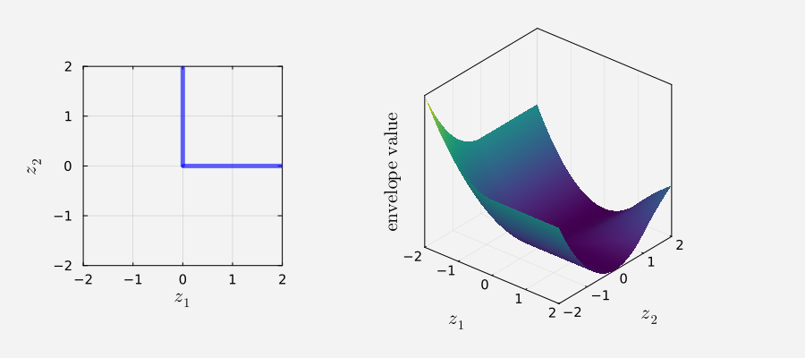
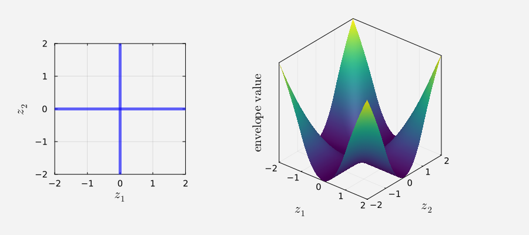
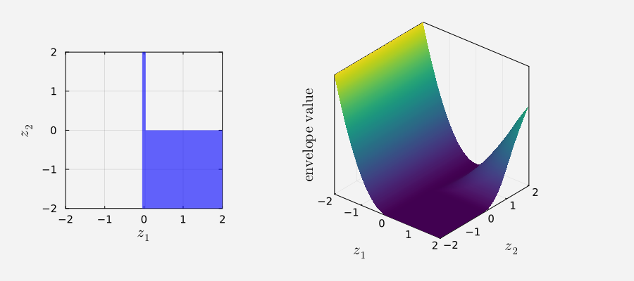

# Lldo.jl

<div align="center">

   *Lasry-Lions Double Envelope Methods for Disjunctive Optimization*

</div>

`Lldo.jl` is a Julia package implementing Lasry-Lions double envelope-based methods for solving mathematical programs with disjunctive constraints.

The package considers optimization problems of the form:

$$
\begin{align}
\underset{x \in \mathbb{R}^n}{\text{minimize}} 
   & \ f(x) \\
\text{subject to}                
   & \ A(x) \in C \\
   & \ F_j(x) \in \bigcup_{i=1}^{p_j} D_{ji} \quad \text{for}\quad j \in \{1,\ldots,r\}
\end{align}
$$

where:
- $f: \mathbb{R}^n \to \mathbb{R}$, $A: \mathbb{R}^n \to \mathbb{R}^m$ and $F_j: \mathbb{R}^n \to \mathbb{R}^{p_j}$ ($p_j\geq2$) are smooth;
- $C\subset\mathbb{R}^m$ and $D_{ji}\subset\mathbb{R}^{p_j}$ are closed, convex sets.

## Lasry-Lions Double Envelopes

- Complementarity constraint and its double envelope:

<p align="center">
  
</p>

- Switching constraint and its double envelope:

<p align="center">
  
</p>

- Vanishing constraint and its double envelope:

<p align="center">
  
</p>

## Constraints

- ✅ The set $C$ encodes the inequality and equality constraints:

$$
C = [-\infty,0]^{m_1} \times \lbrace 0 \rbrace^{m_2}
$$

- ✅ Vertical complementarity constraints:

$$
D_{ji} = \mathbb{R}_+^{i-1} \times \lbrace 0 \rbrace \times \mathbb{R}_+^{p_j-i}
$$

  when $p_j = 2$, this recovers the standard complementarity constraints.

- ⏳ Switching, vanishing, cardinality, chance and integer constraints.

## Data Structures

- `ScalarFunction`: models the objective function $f(x)$.

   ```julia
   f = ScalarFunction(:objective, f_func, f_grad)

   # or, if the gradient is not provided explicitly,
   # automatic differentiation (`ForwardDiff.jl`) is used internally

   f = ScalarFunction(:objective, f_func, nothing)
   ```

  where `f_func` and `f_grad` are analytic expressions with respect to `x`.

  ```julia
  obj_value, grad_value = f(x)
  ```

  where:

  - `obj_value` is a numerical scalar,
  - `grad_value` is a numerical vector.

- `VectorFunction`: models the constraint mappings $A(x)$ and $F_j(x)$.

  ```julia
   A = VectorFunction(:constraint, A_func, A_jaco)

   # or, if the Jacobian is not provided explicitly
   # automatic differentiation (`ForwardDiff.jl`) is used internally

   A = VectorFunction(:constraint, A_func, nothing)
   ```

  where `A_func` and `A_jaco` are analytic expressions with respect to `x`.

  ```julia
  cons_value, jaco_value = A(x)
  ```

  where:

  - `cons_value` is a numerical vector,
  - `jaco_value` is a numerical Jacobian matrix.

- `BoxSet`: models the constraint set $C$.

  ```julia
  C = BoxSet(
      :constraint_set,
      vcat(fill(-Inf, m1), fill(0.0, m2)), # componentwise lower bounds of A(x)
      vcat(fill(0.0,  m1), fill(0.0, m2))  # componentwise upper bounds of A(x)
  )
  ```

## Methods

Given the problem data `f::ScalarFunction`, `F::Vector{VectorFunction}`, `A::VectorFunction` and `C::BoxSet`,
the package provides the following solution methods.

- Lasry-Lions double envelope methods:

   ```julia
   # smooth the augmented Lagrangian using the Lasry-Lions double envelope
   # L-BFGS or Gencan can be used as the inner solver
   result = smooth_alm(f,F,A,C,...)

   # smooth the penalty function using the Lasry-Lions double envelope
   result = smooth_homotopy(f,F,A,C,...)
   ```

- Other methods:

   ```julia
   # solve augmented Lagrangian subproblems with explicit disjunctive-set constraints 
   # a projected-gradient method is used as the inner solver
   result = class_alm(f,F,A,C,...)

   # direct solution using the NLP solver Algencan
   result = direct_algencan(f,F,A,C,...)

   # Scholtes regularization method
   # Algencan is used to solve the regularized subproblems
   result = scholtes(f,F,A,C,...)
   ```

## Usage

The package is not yet publicly registered. 
At this stage, to use `Lldo.jl`, load it directly from the `src` directory when running scripts in the `demo` folder:

```julia
   include("../../src/Lldo.jl") 
   using .Lldo
```

To run an example from the terminal:

```bash
  cd path/to/Lldo.jl
  julia --project=. demo/examples/mpvcc1.jl
```